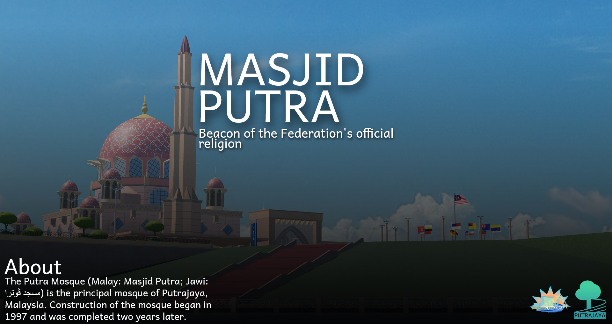

# Putrajaya of Roblox

The official website for **Putrajaya of Roblox**, a Roblox Ro-State roleplay community.

## Media used on the homepage

Homepage media is stored in `assets/Putrajaya/`:

- `WelcomePutrajaya.rblxBanner.png` — video poster/banner artwork
- `IMG_5955.mp4` — homepage city video
- `MasjidPutra.png` — Masjid Putra imagery
- `MilleniumMonumentSunsetLandscape.png` — sunset landmark imagery
- `MinistryofFinanceComplex.png` — civic architecture
- `PICC.png` and `PICCSunsetLandscape.png` — convention centre imagery
- `PalaceOfJustice.png` — civic landmark imagery
- `PerbadananSunset2Lanscape.png` — sunset city imagery
- `PerdanaPutraSunsetLandscape.png` — Perdana Putra imagery
- `PixelStretch3.png` — Putrajaya landmark artwork

The homepage also uses `assets/putrajaya-collage.png` as the large hero image and a wide collage banner.

## How to edit the current site

This is currently a static HTML site. The simplest workflow is:

1. Open the repository on GitHub.
2. Open `blog.html`, `blog-post.html`, `wiki.html`, or `wiki-article.html`.
3. Click the pencil/edit button.
4. Edit the text, links, or image paths.
5. Commit the change to `main`.
6. Wait for GitHub Pages to rebuild.

### Add a blog post manually

For a new post, duplicate `blog-post.html`, rename it—for example `blog-city-update.html`—then edit:

- `<title>`
- the article eyebrow/category
- the main heading
- the article paragraphs
- any image or video

Then add a link to the new file from `blog.html` and from the homepage’s update cards if desired.

### Edit the Wiki manually

- Edit `wiki.html` to change the Wiki index and category links.
- Edit `wiki-article.html` to change the article content.
- For a new article, duplicate `wiki-article.html`, rename it, edit the content, and link it from `wiki.html`.

### Add an image or video

Upload media into `assets/` or `assets/Putrajaya/`, then reference it like this:

```html

<video controls poster="assets/Putrajaya/WelcomePutrajaya.rblxBanner.png">
  <source src="assets/Putrajaya/IMG_5955.mp4" type="video/mp4">
</video>
```

## Easier editing without changing code

The best next step is to add a Git-based CMS such as **Decap CMS**. It provides a browser editor for blog posts and Wiki articles while saving the content back to GitHub. It still needs a one-time setup for GitHub authentication and CMS configuration, but after that you can create and edit posts through an `/admin/` dashboard instead of editing HTML.

Other options:

- **Pages CMS**: simpler GitHub-based browser editor for Markdown files.
- **Airtable/Notion + API**: easier content entry, but requires a small data integration and is less reliable for a simple GitHub Pages site.
- **WordPress/Ghost**: full publishing experience, but requires hosting outside this static GitHub Pages repository.

For this project, Decap CMS or Pages CMS is the most practical route. The current static setup does not yet include a CMS dashboard.

## GitHub Pages

In repository settings, open **Pages**, select **Deploy from a branch**, choose `main` and `/ (root)`, then save.

Published site:

`https://putrajayarblx.github.io/putrajaya-of-roblox/`
